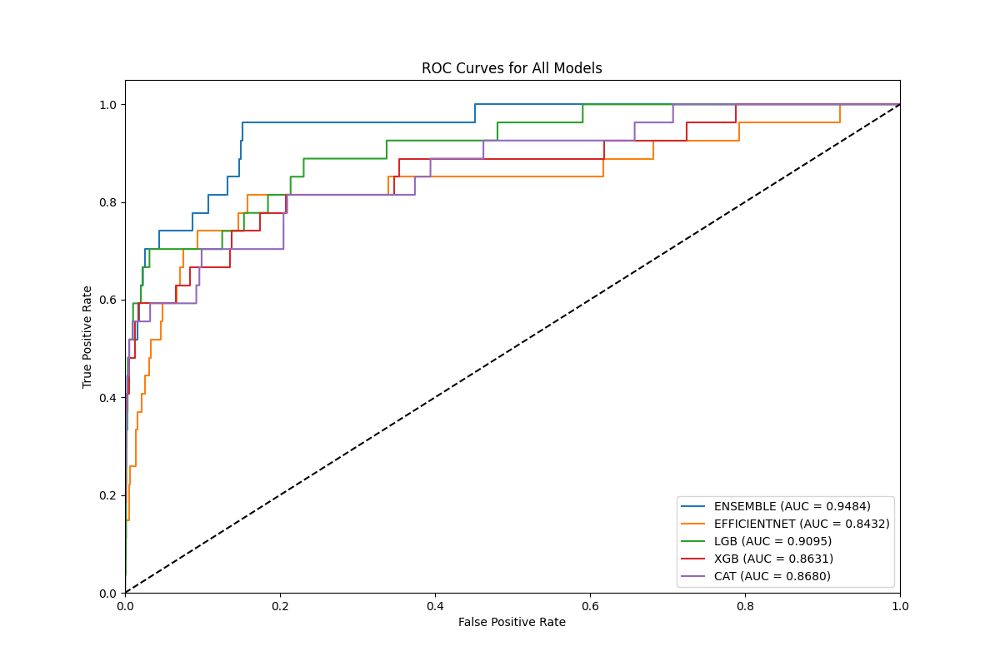

# Skin Cancer Classification Project

A deep learning project for skin cancer classification using ensemble learning combining EfficientNet with gradient boosting models (LightGBM, XGBoost, CatBoost) on ISIC2024 dataset.

## 📊 Dataset

### ISIC2024 Dataset Statistics
- **Total Training Samples**: 353,805 samples
- **Total Test Samples**: 47,254 samples
- **Total Dataset Size**: 401,059 samples
- **Number of Features**: 272 metadata features
- **Image Size**: Resized to 224×224 pixels

### Class Distribution
| Class | Label | Percentage |
|-------|-------|------------|
| Benign | 0 | 99.8966% |
| Malignant | 1 | 0.1034% |

> ⚠️ **Note**: The dataset is highly imbalanced with only ~0.1% malignant samples

### Feature Categories
- **Numerical Columns**: 34 raw features
- **Generated Columns**: 43 engineered features
- **Categorical Columns**: 6 features (one-hot encoded)
- **Normalized Columns**: 77 features
- **Image Features**: 12 columns from ResNet18 extraction
- **Special Features**: Patient-level aggregations

## 🏗️ Model Architecture

### Hybrid CNN-ViT Model (EfficientNetViTHybridModel)

The core image model combines **EfficientNet-B0** (CNN) and **Vision Transformer (ViT-Base)** with attention-weighted feature fusion:

```
                        Input Image (224×224×3)
                                  │
                 ┌────────────────┴────────────────┐
                 │                                 │
                 ▼                                 ▼
    ┌─────────────────────────┐     ┌─────────────────────────┐
    │   EfficientNet-B0       │     │   ViT-Base-Patch16      │
    │   (Pretrained ImageNet) │     │   (Pretrained ImageNet) │
    │                         │     │                         │
    │   Conv Features: 1280   │     │   197 Patch Tokens      │
    │   Global Avg Pooling    │     │   768 dimensions each   │
    └───────────┬─────────────┘     └───────────┬─────────────┘
                │                               │
                ▼                               ▼
    ┌─────────────────────────┐     ┌─────────────────────────┐
    │   Attention Module      │     │   Feature Processing    │
    │   Linear(1280→512)      │     │   CLS Token + Patch Avg │
    │   Tanh → Linear→Sigmoid │     │   LayerNorm + GELU      │
    └───────────┬─────────────┘     └───────────┬─────────────┘
                │                               │
                │     ┌─────────────────────────┤
                │     │                         │
                │     ▼                         ▼
                │     │         ┌─────────────────────────┐
                │     │         │   Attention Module      │
                │     │         │   Linear(768→512)       │
                │     │         │   Tanh → Linear→Sigmoid │
                │     │         └───────────┬─────────────┘
                │     │                     │
                ▼     ▼                     ▼
    ┌─────────────────────────────────────────────────────┐
    │              Feature Concatenation                   │
    │              Eff(1280) ⊕ ViT(768) = 2048            │
    └───────────────────────┬─────────────────────────────┘
                            │
                            ▼
    ┌─────────────────────────────────────────────────────┐
    │                  Fusion Network                      │
    │  ┌───────────────────────────────────────────────┐  │
    │  │ Linear(2048→1024) + BN + ReLU + Dropout(0.4)  │  │
    │  │ Linear(1024→512)  + BN + ReLU + Dropout(0.3)  │  │
    │  │ Linear(512→256)   + BN + ReLU + Dropout(0.2)  │  │
    │  │ Linear(256→1)     → Sigmoid                   │  │
    │  └───────────────────────────────────────────────┘  │
    └───────────────────────┬─────────────────────────────┘
                            │
                            ▼
                    Binary Classification
                    (Malignant/Benign)
```

### Model Components

| Component | Architecture | Parameters |
|-----------|--------------|------------|
| **CNN Branch** | EfficientNet-B0 | Last 4 layers trainable |
| **ViT Branch** | ViT-Base-Patch16-224 | Last 4 layers trainable |
| **EfficientNet Features** | 1280 dimensions | Global Average Pooling |
| **ViT Features** | 768 dimensions | CLS Token + Patch Avg |
| **Fusion Network** | 4-layer MLP | 2048→1024→512→256→1 |
| **Attention** | Soft attention | Per-branch feature weighting |

### Ensemble Pipeline
```
                         ┌─────────────────┐
                         │   Input Data    │
                         └────────┬────────┘
                                  │
              ┌───────────────────┼───────────────────┐
              │                   │                   │
              ▼                   ▼                   ▼
    ┌─────────────────┐ ┌─────────────────┐ ┌─────────────────┐
    │  CNN-ViT Hybrid │ │   TabularBoost  │ │   Metadata      │
    │  (EfficientNet  │ │   (LGB/XGB/CAT) │ │   Features      │
    │   + ViT-Base)   │ │                 │ │                 │
    └────────┬────────┘ └────────┬────────┘ └────────┬────────┘
             │                   │                   │
             └───────────────────┼───────────────────┘
                                 ▼
                       ┌─────────────────┐
                       │   Ensemble      │
                       │   (Weighted)    │
                       └─────────────────┘
```

### Available Models
1. **EfficientNet-B0**: Pure CNN with attention mechanism
2. **Vision Transformer (ViT-Base)**: Pure transformer approach  
3. **Hybrid CNN-ViT**: Combined architecture with dual attention (recommended)
4. **LightGBM**: Gradient boosting on metadata features
5. **XGBoost**: Gradient boosting with SMOTE sampling
6. **CatBoost**: Categorical-aware gradient boosting

## 🔄 Data Processing Pipeline

### Sampling Strategies (for imbalanced data)
- **SMOTE**: Synthetic Minority Over-sampling
- **Borderline-SMOTE**: Focus on borderline samples
- **ADASYN**: Adaptive synthetic sampling
- **SMOTE-Tomek**: SMOTE + Tomek links cleaning

### Cross-Validation
- **3-Fold StratifiedGroupKFold**: Stratified by class, grouped by patient
- **Patient-level splitting**: Prevents data leakage between folds
- **Best sampling strategy**: Automatically selected based on validation pAUC

## 📈 Performance Results

### Ensemble Model Results (Test Set)


| Model | ROC AUC | pAUC (0-10% FPR) | pAUC (0-20% FPR) |
|-------|---------|------------------|------------------|
| **Ensemble** | **0.9484** | 0.5840 | 0.5549 |
| LightGBM | 0.9095 | 0.6373 | 0.7040 |
| CatBoost | 0.8680 | 0.5683 | 0.6373 |
| XGBoost | 0.8631 | 0.5548 | 0.6021 |
| EfficientNet | 0.8432 | 0.4802 | 0.6009 |

### Cross-Validation Results (Best Strategies)

#### LightGBM (Best: SMOTE-Tomek, pAUC=0.8019)
| Metric | Mean | Std |
|--------|------|-----|
| ROC AUC | 0.9490 | ±0.0252 |
| pAUC (0-10% FPR) | 0.6833 | ±0.1216 |
| pAUC (0-20% FPR) | 0.7864 | ±0.0988 |

#### XGBoost (Best: SMOTE, pAUC=0.8313)
| Metric | Mean | Std |
|--------|------|-----|
| ROC AUC | 0.9590 | ±0.0184 |
| pAUC (0-10% FPR) | 0.7199 | ±0.1005 |
| pAUC (0-20% FPR) | 0.8250 | ±0.0645 |

#### CatBoost (Best: SMOTE, pAUC=0.7813)
| Metric | Mean | Std |
|--------|------|-----|
| ROC AUC | 0.9510 | ±0.0345 |
| pAUC (0-10% FPR) | 0.6975 | ±0.1397 |
| pAUC (0-20% FPR) | 0.7516 | ±0.2166 |

#### EfficientNet (3-Fold CV)
| Metric | Mean | Std |
|--------|------|-----|
| ROC AUC | 0.8477 | ±0.0190 |
| pAUC (0-10% FPR) | 0.4275 | ±0.0063 |
| pAUC (0-20% FPR) | 0.5516 | ±0.0052 |

## ⏱️ Training Duration

| Component | Duration |
|-----------|----------|
| LightGBM | 0:36:55 |
| XGBoost | 0:35:07 |
| CatBoost | 0:34:15 |
| EfficientNet | 13:42:33 |
| Test Evaluation | 0:03:27 |
| **Total Pipeline** | **15:32:40** |

## 🚀 Usage

### Requirements
```bash
pip install torch torchvision timm
pip install scikit-learn lightgbm xgboost catboost
pip install pandas polars numpy matplotlib seaborn
pip install imbalanced-learn tqdm joblib pillow
```

### Training ISIC2024 Model
```bash
python SCC_isic.py
```

### Training PAD-UFES-20 Model
```bash
python SCC_pad.py
```

### Configuration
Key parameters in the scripts:
- `N_SPLITS`: Number of cross-validation folds (default: 3)
- `IMG_MODEL_BATCH_SIZE`: Batch size for EfficientNet training
- `SAMPLING_STRATEGIES`: List of sampling methods to evaluate

## 📁 Output Structure

```
20250526_130537_ensemble_img_metadata/
├── cat/
│   ├── models/           # Saved CatBoost models
│   └── plots/            # ROC curves, metrics distribution
├── efficientnet/
│   ├── models/           # Saved EfficientNet checkpoints
│   └── plots/            # Training curves
├── lgb/
│   ├── models/           # Saved LightGBM models
│   └── plots/            # Feature importance, ROC curves
├── xgb/
│   ├── models/           # Saved XGBoost models
│   └── plots/            # ROC curves, metrics
├── plots/
│   └── ensemble_roc_curves.png   # Final ensemble comparison
├── models/               # Final ensemble models
└── text/
    ├── pipeline_log.txt          # Full training log
    ├── ensemble_results.txt      # Final test results
    └── [model]_results.txt       # Per-model results
```

## 🔑 Key Features

- **Multi-modal Learning**: Combines image features (EfficientNet) with tabular metadata (Gradient Boosting)
- **Ensemble Strategy**: Weighted combination of multiple model predictions
- **Advanced Sampling**: Multiple SMOTE variants to handle extreme class imbalance
- **Cross-validation**: Robust evaluation with patient-level stratified splitting
- **GPU Acceleration**: CUDA support for EfficientNet training (RTX 4050 Laptop GPU)
- **Comprehensive Logging**: Detailed pipeline logs with timing information

## 📊 Evaluation Metrics

- **ROC AUC**: Area Under Receiver Operating Characteristic curve
- **pAUC (0-10% FPR)**: Partial AUC at low false positive rates (clinical relevance)
- **pAUC (0-20% FPR)**: Partial AUC for broader FPR range
- **Normalized pAUC**: Scaled partial AUC for easier interpretation

---

*Experiment: `20250526_130537_ensemble_img_metadata`*
*GPU: NVIDIA GeForce RTX 4050 Laptop GPU*
*CUDA Version: 12.1*
